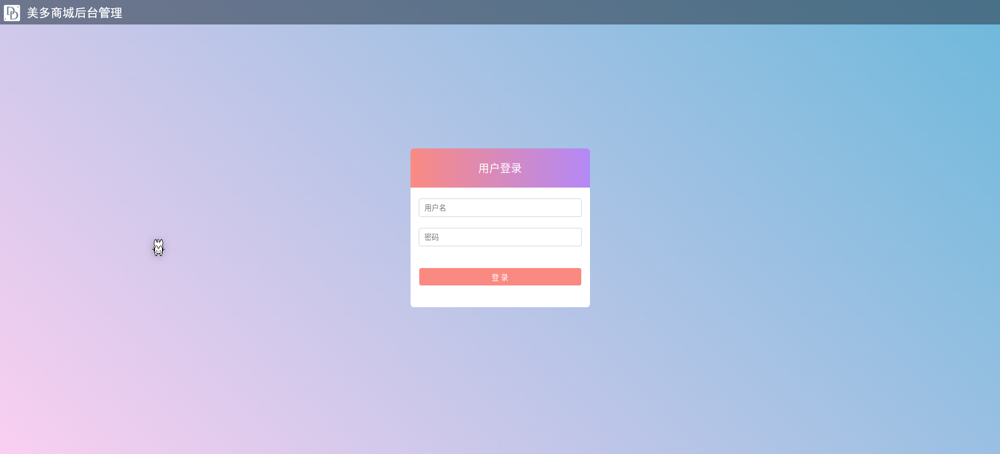
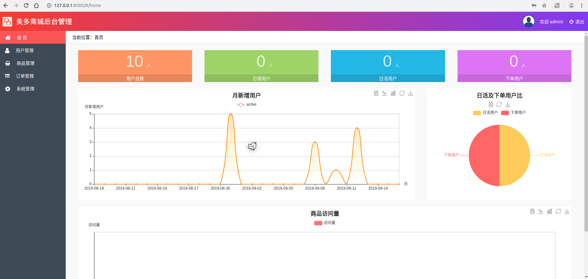
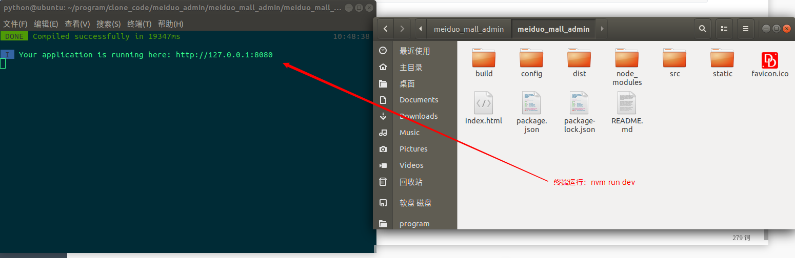

# meiduo_admin
## meiduo 管理后台项目
美多后台项目包括两部分

- 美多商城前台项目
  - `meiduo`
- 美多后台管理项目
  - `meiduo_admin`
  - 
  - 

## 美多后台管理项目

从上面的截图可以看到，美多商城后台管理项目主要有５个模块：

- 首页
- 用户管理
- 商品管理
  - SKU管理
  - SPU管理
  - 规格管理
  - 规格选项管理
  - 频道管理
  - 品牌管理
  - 图片管理
- 订单管理
- 系统管理
  - 权限管理
  - 用户组管理
  - 管理员管理

### meiduo_admin项目的启动

meiduo_admin项目需要依赖node、vue-cli

首先需要安装nvm跟node还有vue-cli

- 安装node版本管理工具nvm

  - ```bash
    curl -o- https://raw.githubusercontent.com/creationix/nvm/v0.33.11/install.sh | bash
    // 更新配置
    source .bashrc
    ```

- 安装最新版本的node

  - ```bash
    nvm install node
    ```

- 更新npm的安装源

  - ```bash
    npm config set registry https://registry.npm.taobao.org
    ```

- 安装vue-cli

  - 全局安装vue-cli

  - ```bash
    npm install --global vue-cli
    ```

  - 项目创建

  - ```bash
    vue init webpack 项目名
    ```

  - 运行调试项目

  - ```bash
    // 进入项目目录下，执行下面指令
    npm run dev
    ```

  - 项目打包

  - ```bash
    npm run build
    ```

启动meiduo_admin项目

进入到meiduo_admin内，执行`nvm run dev`即可运行项目



启动完成后就可以在浏览器输入`127.0.0.1:8080`访问meiduo_admin的登录界面了。

如果想要进行登录，还需要创建用户。创建用户需要前台的meiduo项目启动，通过django的命令创建用户。